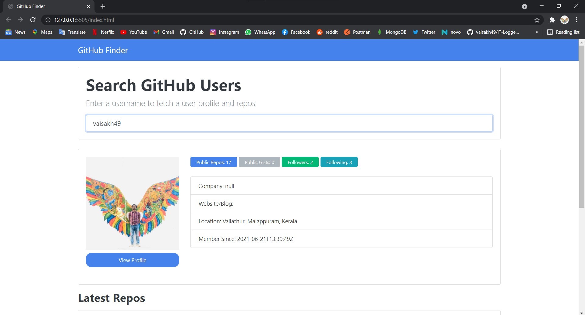
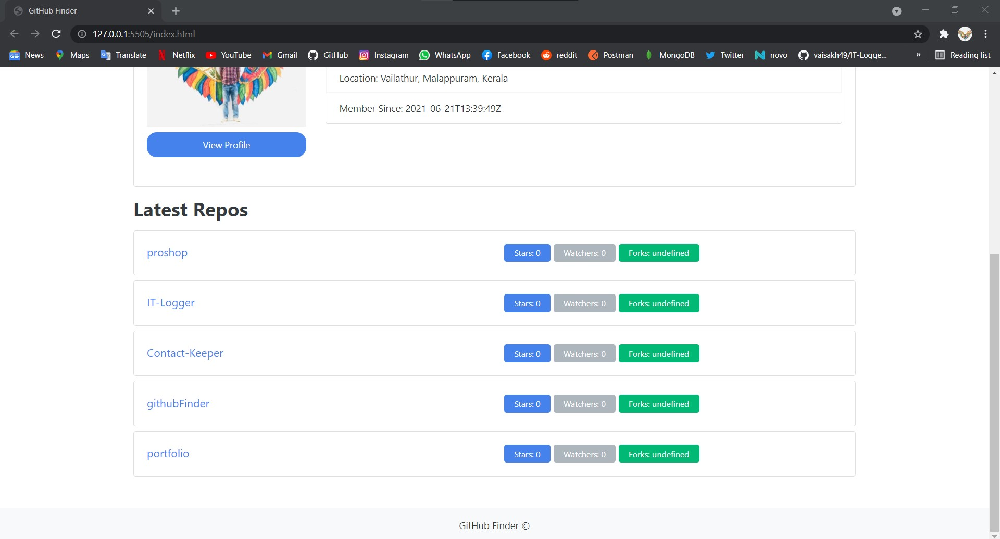

# githubFinder_js
A github profile searching and getting application. Using github api.

<a href='https://heuristic-hypatia-0fa964.netlify.app/'>Go to site</a>

<h2>Screenshots</h2>

<h3>Home</h3>
 
 
